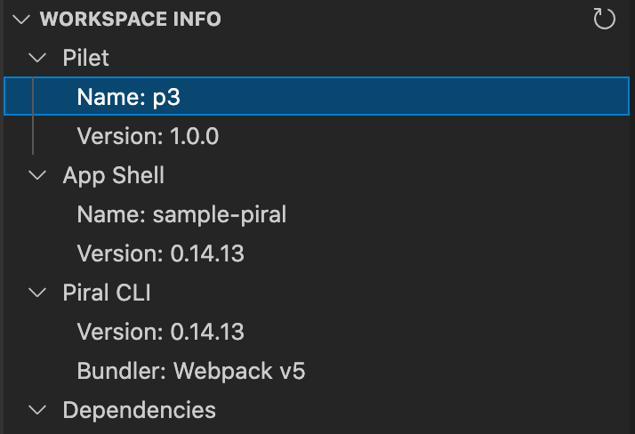
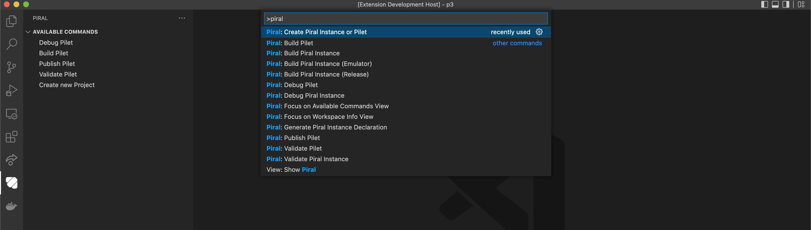
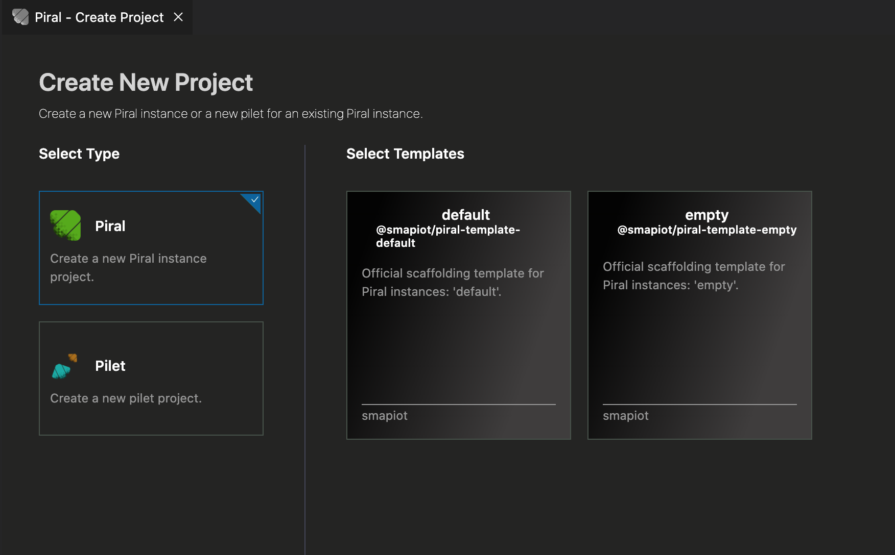
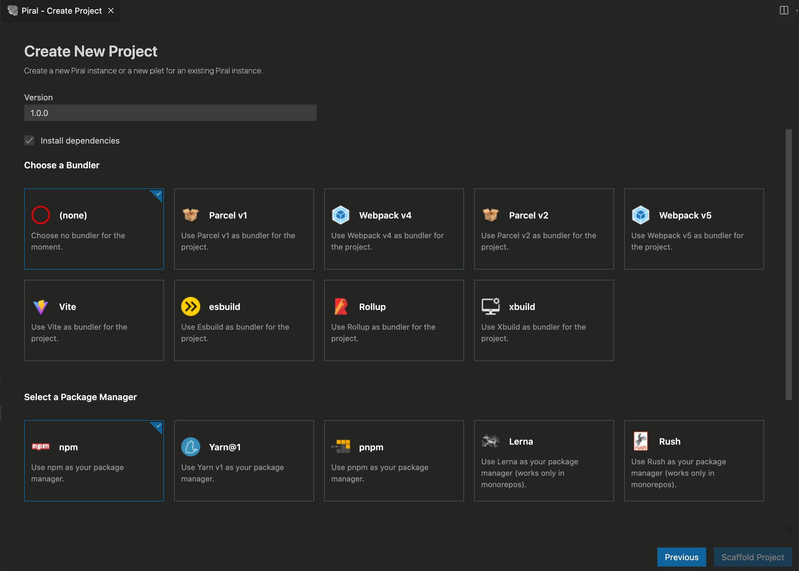
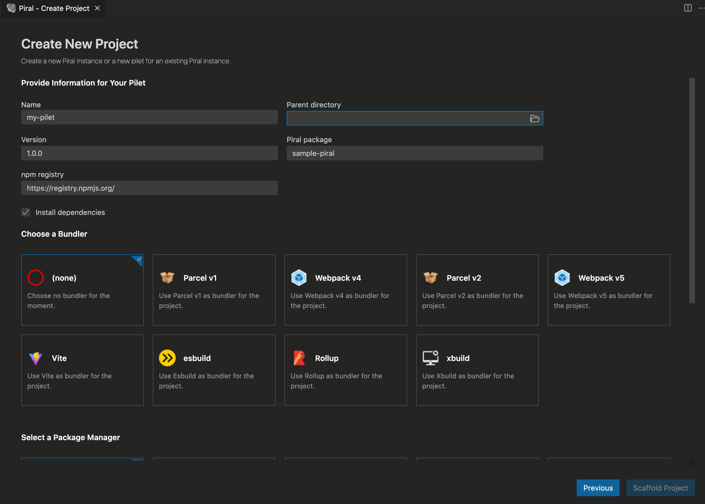
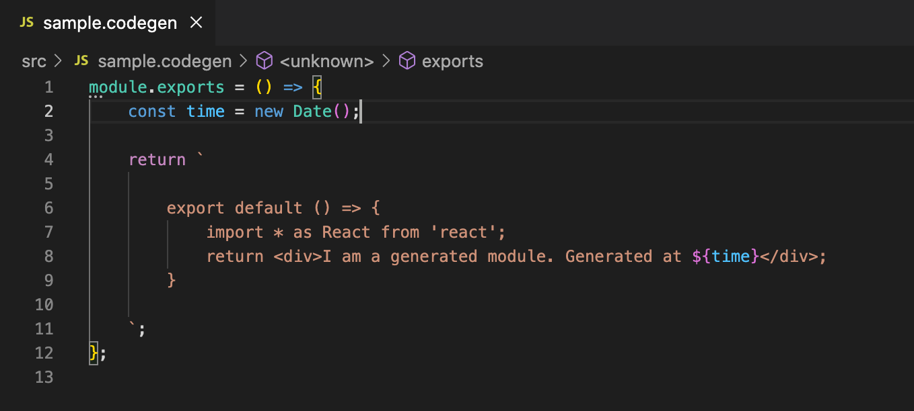

[](https://piral.io)

# `piral-vscode`

[](https://marketplace.visualstudio.com/items?itemName=smapiot.vscode-piral) [](https://open-vsx.org/extension/smapiot/vscode-piral) [](https://github.com/smapiot/vscode-piral/actions/workflows/node.js.yml) [](https://github.com/smapiot/vscode-piral/releases) [](https://github.com/smapiot/vscode-piral/issues) [](https://gitter.im/piral-io/community) [](https://github.com/smapiot/vscode-piral/blob/main/LICENSE)

The official VS Code extension for [Piral](https://piral.io).

Available in the following marketplaces:

- [VS Code Marketplace](https://marketplace.visualstudio.com/items?itemName=smapiot.vscode-piral) for VS Code
- [Open VSX](https://open-vsx.org/extension/smapiot/vscode-piral) for VSCodium, code-server and Eclipse Theia

## Prerequisites

You'll need **Node.js (v16+)** with **npm (v7+)** installed for using the extension.

The extension works on all OS where VS Code is running.

## Overview

This extension is a useful companion when developing Piral based app shells, or pilets for existing app shells.

It can be regarded as a visualizer for the `piral-cli` command line utility. However, our plan is to extend it with more functionality, usually tied very closely to the VS Code editing experience.

## Features

Right now the following features are part of this extension:

- A workspace panel info with plugins, dependencies, versions, ...
- Additions to the command palette using useful commands (e.g., `piral debug`)
- A provider for `.codegen` files (essentially using JavaScript as language)
- A wizard for scaffolding new projects (Piral instances or pilets)
- Additional debugging utilities and tools
- Start, build, validate, ... run all commands without a command line

### Workspace

When the extension detects a Piral instance or pilet folder opened it automatically fills some workspace information. The workspace info also contains links to documentation and helpful resources.



### Tasks

You can add provided tasks for your Piral instances or pilets.

- `piral: debug` - a build (watch) task to debug the Piral instance
- `piral: build` - a build task to build the Piral instance
- `piral: validate` - a test task to validate the Piral instance
- `piral: declaration` - a build task to generate the declaration for the Piral instance
- `pilet: debug` - a build (watch) task to debug the pilet
- `pilet: build` - a build task to build the pilet
- `pilet: validate` - a test task to validate the pilet
- `pilet: pack` - a build task to pack the pilet

You can either run these tasks manually or use them, e.g., in a *launch.json*:

```json
{
    "version": "0.2.0",
    "configurations": [
        {
            "type": "chrome",
            "request": "launch",
            "name": "Launch Chrome against localhost",
            "url": "http://localhost:1234",
            "webRoot": "${workspaceFolder}",
            "preLaunchTask": "pilet: debug"
        }
    ]
}
```

### Problem Matcher

If you make your own task using the `piral-cli` you can use the `$piral-cli-debug` problem matcher to monitor the `piral debug` / `pilet debug` commands.

### Command Palette

All commands that are relevant to Piral can be run from the command palette.



### Scaffold Project Wizard

A new project can be scaffolded directly from VS Code. Right now two project types are supported.



### Scaffold Piral Instance Wizard

When a Piral instance should be scaffolded additional information is requested. All options can be selected graphically.



### Scaffold Pilet Wizard

When a pilet should be scaffolded additional information is requested. All options can be selected graphically.



### Codegen Support

With this extension you'll get support for `*.codegen` files. This boils down to getting JS support associated with such files.



## Development

### Installation

Clone the repository and install the dependencies using `npm`:

```sh
npm i
```

Then open VS Code (`code .`) and run it using `F5`.

### Publish

For publishing the official command line tool `vsce` should be used.

```sh
vsce package
vsce publish -p <token>
```

This will package the current version of the repository and publish it. Make sure to have the right token specified. Follow the [instructions outlined here](https://code.visualstudio.com/api/working-with-extensions/publishing-extension#get-a-personal-access-token) to get a new one.
